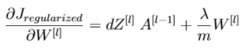

# ProjectsJupyter

Some of these projects were born after having followed the specialization in Deep Learning offered by [deeplearning.ia](https://www.deeplearning.ai/) on Coursera.
The aim is to carry out my own projects, from scratch, by improving my knowledge, implementations and explanations and taking into account the new knowledge acquired.

## 0. Logic Regression with a shallow Neural Network

[Notebook](0_LogicRegressionNN/CatRecognitionWithNN.ipynb)

Here is the shallow neural network used to classify images as being either "Cat" or "Non-Cat" :

With `n = width x height x 3` (we are using RGB images) and $m$ the number of images in the dataset.

The choice of using ***batch gradient descent*** leads to the cost function being:

The training and the results are as follows:

This network hasn't been tuned, feel free to tune it as you want (their is a high variance here, we are clearly over-fitting the training set)! For a network as simple as this, the accuracy on the test set is **68.0 %**!

The resulted weights and biases are available in the folder `0_LogicRegressionNN/parameters`.

## 1. 2D Data Classification using a shallow Neural Network with 1 hidden layer

[Notebook](1_OneHiddenLayerDataClassification/DataClassifier.ipynb)

Here are the randomly generated data that need to be classified (either red or blue):

If you want to change the datas (reducing the ellipsis fitting, increase the number of points, ...), please feel free to modify the function `construct_planar_dataset`.

To classify those data and construct the decision boundaries, the following network has been implemented. This network contains **1 hidden layer** and different number of neurons in it have been tested:

We used ***batch gradient descent*** and the cost function is:

You can find all the details for the calculus (derivatives, backprop, ...) in the related [notebook](1_OneHiddenLayerDataClassification/DataClassifier.ipynb).

The decision boundaries are as follow:

The resulted weigts and biases are available in the folder `1_OneHiddenLayerDataClassification/parameters`.

## 2. Logic Regression with a Deep Neural Network

[Notebook](2_L-LayerNN/L-NNConstruction.ipynb)

Here, we come back on the "Cat" / "Non-Cat" classification but using this time a deep Neural Network (not a CNN!):

With `n0 = width x height x 3` (we are using RGB images) and `m` the number of images in the dataset.

The choice of using ***batch gradient descent*** leads to the cost function being:

The training and the results are as follows:

This network hasn't been tuned, feel free to tune it as you want (we are still over fitting the training set)! By just adding 3 layers to the first network tested on this cat dataset, the accuracy went up from 68.0% to **76.0 %** on the test set!

The resulted weights and biases are available in the folder `2_L-LayerNN/parameters`.

## 3. Gradient Checking algorithm

[Notebook](3_GradientChecking/GradientChecking.ipynb)

Here, we'll briefly implement gradient checking to ensure that our gradient computations are correct. To do so, we'll use the first derivative formula:

Then,

Therefore,

And then:

The runtime is quite high with this algorithm as every gradient is computed 3 times and then compared.

## 4. Regularization techniques

[Notebook](4_Regularization/Regularization_L2Reg_Dropout.ipynb)

Now that the gradient are checked , let's come back on our deep architecture's results (train set: 99.0% / test set: 76.0 %). The dataset is quite small and we are clearly over-fitting it. One way of improving our result could by digging on the internet and download a much **larger** and **representative** dataset. This is not really the point and we will assume that *this not possible*.

As a reminder, here is the architecture:

In order to have better results, several choices can be made. We can decide to:

1. Change the architecture, i.e., change either the number of hidden layer, the number of neurons per hidden layer or the activation functions.
1. Use regularization techniques:
   * Reduce over-fitting by changing the cost function adding **L2 Regularization**;
   * Reduce over-fitting by adding **Dropout** in the deep learning model.
3. Augment the training set by doing **Data Augmentation**.

In this notebook, we'll focus on the **regularization techniques**.

### 4.1 L2 Regularization

**L2 regularization** consists of modifying the cost function from:

To,

Therefore,

### 4.2 Dropout

**Dropout** is a technique specific to deep learning: it randomly shuts down some neurons in each iteration.

At each iteration, the idea is to shut down each neuron of a layer `[l]` with a probability `1 - keep_prob[l]` or keep it with a probability `keep_prob[l]`. The dropped neurons don't contribute to the training in both the forward and backward propagations of the iteration.

## 5. Data Augmentation

[Notebook](5_DataAugmentation/DataAugmentation.ipynb)

## 6. Optimization techniques

[Notebook](6_Optimization/Optimization.ipynb)

Here, we will focus on optimization techniques:
- **Mini-batch gradient descent** (instead of batch gradient descent)
- **Adam algorithm**

### 6.1 Mini-batch gradient descent

We were using **batch gradient descent**, it means that we go through all the dataset, compute all the costs and sum them to obtain the cost function. Another way of doing it is by splitting the dataset within mini-batches of chosen size (generally a power of 2 such as 32, 64, 128, ...).

There are two steps:

1. **Shuffle**: Create a shuffled version of the training set (X, Y).
1. **Partition**: Partition the shuffled (X, Y) into mini-batches of size `mini_batch_size`. The number of training examples is not always divisible by `mini_batch_size`, therefore the last mini batch might be smaller.

Here is an example with `mini_batch_size = 64`:

We then sequentially compute the cost function and back propagate the derivatives through the different mini-batches. 

### 6.2 Adam optimizer
    
The **Adam optimizer** is another optimizer that replace gradient descent by combining ideas from RMSprop and Momentum.

#### 6.2.a Momentum

Where we try to optimize a cost function which has contours like below and where the red dot denotes the position of the local optima, the behaviour look like the path in yellow:

Therefore, by using the **exponentially weighted average** values of `dW` and `db`, we tend to average out the oscillations in the vertical direction closer to zero as they are in both directions (positive and negative). Whereas, on the horizontal direction, all the derivatives are pointing to the right of the horizontal direction, so the average in the horizontal direction will still be pretty big. It allows the algorithm to take more straight forwards path towards local optima and damp out vertical oscillations. Due to this reason, the algorithm will end up at local optima with a few iterations:

With `β ∈ [0, 1]` another hyper-parameter called *momentum*, the implementation is as follow:

And then:

#### 6.2.b RMSprop

The **MSprop optimizer** is similar to the gradient descent algorithm with momentum. The RMSprop optimizer restricts the oscillations in the vertical direction. Therefore, we can increase the *learning rate* and the algorithm could take larger steps in the horizontal direction converging faster. The difference between RMSprop and gradient descent is on how the gradients are calculated. 

With `β ∈ [0, 1]` another hyper-parameter called *momentum*, the implementation is as follow:

And then, with `𝜖 ≃ 10−7` to avoid division by 0:

#### 6.2.c Adam

The **Adam optimizer** takes then 2 hyperparameters $(β1, β2) \in [0, 1]$ and with $t$ the iteration, the implementation is as follow :

And then, with `𝜖 ≃ 10−8` to avoid division by 0:

You can usually set `β1 = 0.9` and `β2 = 0.999`

## 7. Detect fingers made numbers using Tensorflow